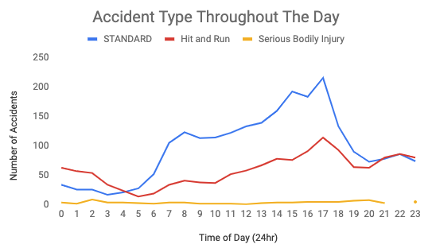

# Business Fundamentals MVP

Business Impact: Incrase Apple Maps market share in smart phone navigation apps industry.

Data Science Impact: Predict what types of traffics accidents happen on which roads at what times. Use output from this prediction model to assign dynamic "safety rating" to a given road along a driving route entered into Apple Maps.

Impact Hypothesis: We want to increase Apple Map's market share within the navigation app space. We believe adding a new feature that provides a safety rating for suggested trip routes will accomplish this goal. Specifically, the app would provided multiple route options after the user enters their starting point and destination. For each trip, the app would provide a "quickest route" option and "safest route" option, along with the "safety rating" for both routes.

As an initial step in my EDA, I wanted to see what time of day most accidents occur. The above chart shows that most accidents happen during the evening rush hour. Further, most accidents are fairly minor in nature, that is, they do not involve serious bodily injury or death.

The above chart represents all accidents that took place in Denver between June through September. As next steps, I'd further like to group accidents by road location and accident type to investigate recurring accident patterns or common accident roadways.
